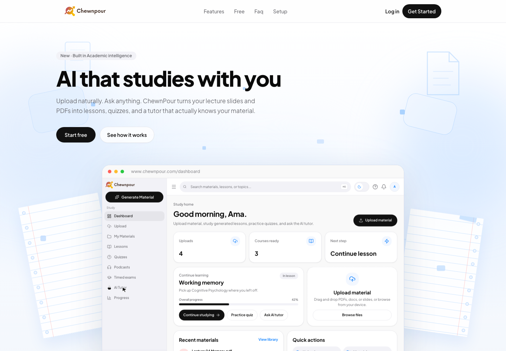
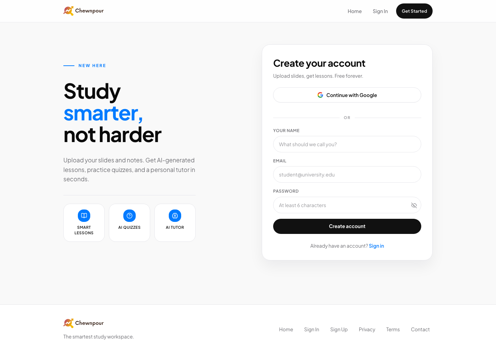

# Chewnpour

Chewnpour is an open-source AI study workspace that turns uploaded learning material into lessons, quizzes, progress tracking, and tutor support.

## Overview

Chewnpour is designed for learners who want to study from their own course material. The main application accepts supported documents and audio, extracts or transcribes their content, and presents a study loop built around generated lessons, quizzes, exams, progress, and an AI tutor.

The repository is a monorepo-style codebase with several independently run packages. There is no root package manager workspace or single root test command.

## Why Chewnpour exists

Course material is often scattered across slide decks, documents, and recordings. Chewnpour provides one place to bring that material into a structured study workflow, while keeping the source material available as context for lessons and tutor interactions.

## Key features

The current application code includes:

- Account creation and sign-in through Better Auth, with optional Google OAuth.
- Upload handling for PDF, DOCX, PPTX, and supported audio formats.
- Document extraction, OCR fallback for scanned PDFs, and audio transcription.
- AI-assisted course and lesson generation with normalized topics and quiz content.
- Lesson reading, topic explanations, streaming tutor chat, and optional grounded retrieval.
- Quizzes, exams, quiz attempts, progress tracking, notes, and study activity.
- Podcast-style topic generation using an LLM script and Deepgram text-to-speech.
- Private Supabase Storage for uploaded files and PostgreSQL-backed application data.
- A separate study-agent package for lesson-scoped, authenticated worker sessions.

Some routes and product experiments remain intentionally paused in the current UI. They are not described as available features here.

## Screenshots and product preview

The following screenshots were captured from the public production site, [www.chewnpour.com](https://www.chewnpour.com/), on 2026-09-16. The homepage image includes a marketing preview of the study dashboard; the values shown inside that preview are illustrative, not usage metrics.

## Architecture

The current main application is a React and Vite frontend with same-origin API handlers in stitch-app/api and server modules in stitch-app/server. Those handlers use Better Auth, PostgreSQL, Supabase Storage, external AI and media services, and the database migrations under stitch-app/supabase.

The standalone docling-service is a FastAPI service for authenticated document extraction. The study-agent package is a separate Eve-based worker application that shares PostgreSQL and uses lesson-scoped worker session authentication.

See [docs/ARCHITECTURE.md](docs/ARCHITECTURE.md) for the component-by-component description and deployment boundaries.

## Repository structure

| Path | Purpose |
| --- | --- |
| stitch-app/ | React/Vite frontend, API router, server modules, migrations, and browser/regression scripts |
| docling-service/ | FastAPI document-extraction adapter backed by Docling |
| study-agent/ | Eve-based study-worker application |
| chewnpour-product-video/ | Hyperframe-based product-video project |
| apps/ | Small repository utility packages, including the QA skill-update helper |
| .github/workflows/ | GitHub Actions workflows |
| docs/ | Architecture, release, settings, and project-preparation documentation |
| .factory/ and other agent/skill directories | Repository-local automation and agent guidance; these are retained as project assets |

## Tech stack

- Frontend: React 19, Vite, React Router, Tailwind CSS, Radix UI, and Vite PWA.
- Main server/API: Node.js modules, Vercel-compatible API handlers, Better Auth, and pg.
- Data: PostgreSQL through Supabase, Supabase Storage, and optional pgvector retrieval.
- AI and media: OpenAI-compatible provider clients, Deepgram speech services, Voyage embeddings, OCR.space, and document parsers.
- Extraction service: Python 3.11–3.13, FastAPI, Uvicorn, and Docling.
- Study worker: Node.js 24 or newer, TypeScript, Eve, PostgreSQL, and Vercel connection support.
- QA: GitHub Actions, the repository QA skill, Factory droid, ESLint, Vite builds, pytest, and package-specific regression scripts.

## Getting started

### Prerequisites

Install the following before starting:

- Node.js 22 or newer for stitch-app.
- Node.js 24 or newer for study-agent, as declared by its package metadata.
- Python 3.11 through 3.13 for docling-service.
- PostgreSQL-compatible database access for the server packages.
- Credentials for the external providers needed by the flow you want to exercise.

### Installation

Install each package independently:

~~~bash
git clone https://github.com/stunner100/Chewnpour.git
cd Chewnpour

npm install --prefix stitch-app
npm install --prefix study-agent

cd docling-service
python3 -m venv .venv
source .venv/bin/activate
python -m pip install -e ".[dev]"
~~~

The product-video package is optional. If you work on it, install its dependencies with:

~~~bash
npm install --prefix chewnpour-product-video
~~~

### Environment configuration

The main application has a sanitized variable reference at [stitch-app/.env.example](stitch-app/.env.example). Copy it to stitch-app/.env.local for local work and fill only the providers and services you have configured:

~~~bash
cp stitch-app/.env.example stitch-app/.env.local
~~~

The database URL, Better Auth secret, and server-side provider keys must remain private. Do not commit .env files or real credentials.

The worker has its own variable reference at [study-agent/.env.example](study-agent/.env.example). The extraction service has a safe local template at [docling-service/.env.example](docling-service/.env.example).

Apply the SQL migrations in stitch-app/supabase/migrations through the configured Supabase/PostgreSQL workflow before exercising database-backed features. This repository does not contain a single root migration command.

### Running locally

For the main application, start the development API/auth process in one terminal:

~~~bash
cd stitch-app
npm run dev:auth
~~~

Then start Vite in a second terminal:

~~~bash
cd stitch-app
npm run dev
~~~

Open the local Vite URL shown in the terminal, normally http://localhost:5173. The Vite configuration proxies the auth and selected API paths to the local development server on port 8787 by default.

To run the extraction service locally:

~~~bash
cd docling-service
source .venv/bin/activate
uvicorn render_api.app:app --reload --port 10000
~~~

The service exposes GET /health and the authenticated POST /extract contract. Its environment and security behavior are documented in [docs/ARCHITECTURE.md](docs/ARCHITECTURE.md).

The study-agent package exposes package scripts for Eve development and production startup. Use its own package environment and the instructions in [study-agent/agent/instructions.md](study-agent/agent/instructions.md) before connecting it to a deployed worker runtime.

### Testing

There is no root npm test script. Use the package-specific commands:

~~~bash
cd stitch-app
node scripts/run-all-tests.mjs
~~~

The runner discovers the checked-in stitch-app/scripts/*.test.mjs files and skips tests that require live services unless explicitly requested. To run one regression file, use node scripts/<name>.test.mjs from stitch-app.

For the extraction service:

~~~bash
cd docling-service
source .venv/bin/activate
pytest
~~~

For the study worker:

~~~bash
npm run typecheck --prefix study-agent
npm run build --prefix study-agent
~~~

### Linting

~~~bash
npm run lint --prefix stitch-app
~~~

The product-video package also provides npm run lint, but it is independent from the main application.

### Building

~~~bash
npm run build --prefix stitch-app
npm run build --prefix study-agent
~~~

The extraction service is containerized with [docling-service/Dockerfile](docling-service/Dockerfile). The repository also includes [render.yaml](render.yaml) for a Render deployment definition for that service.

### QA and CI

The GitHub Actions workflow at [.github/workflows/qa.yml](.github/workflows/qa.yml) runs on pull requests and manual dispatch. It checks out the full history, runs the PR-size gate, installs ImageMagick, sets up Node 22 and Python 3.13, installs the Factory droid CLI, and runs the repository QA skill. The QA step is allowed to finish so its report can be uploaded and posted, then the job fails if that step failed.

The workflow may use repository secrets for test accounts, provider integrations, and the extraction service. It uploads qa-results and qa-output.txt as short-lived artifacts and can open a draft catalog-update PR when the QA run produces approved skill updates. See [CONTRIBUTING.md](CONTRIBUTING.md) for the contributor-facing implications.

### Deployment overview

The current deployment arrangement reported by the maintainer uses Vercel for the frontend/API deployment and Supabase for PostgreSQL and Storage backend services. The repository includes a Vercel-compatible configuration in stitch-app/vercel.json. The extraction service has a Dockerfile and a Render service definition in render.yaml. DigitalOcean App Platform manifests are also present under .do/, but they reference a feature branch and should be verified against the intended deployment before use.

These files describe deployment targets; they are not proof of the currently active production deployment. Confirm production provider, domains, secrets, migrations, and health checks in the relevant hosting dashboards before releasing.

## Contributing

Start with [CONTRIBUTING.md](CONTRIBUTING.md). Small, focused pull requests are easier to review. Please include the commands you ran and call out provider-dependent or blocked checks. The project uses GitHub pull requests and the QA workflow for review.

## Security

Please read [SECURITY.md](SECURITY.md) before reporting a vulnerability. Do not post credentials, tokens, private user data, or exploitable details in a public issue.

## Roadmap

[ROADMAP.md](ROADMAP.md) records work derived from open pull requests, repository TODOs, existing documentation, and unfinished systems. Items marked Proposal are not commitments.

## Maintainers

Chewnpour is maintained by [Patrick Annor](https://github.com/stunner100). See [MAINTAINERS.md](MAINTAINERS.md).

## License

Chewnpour is available under the [Apache License 2.0](LICENSE).
